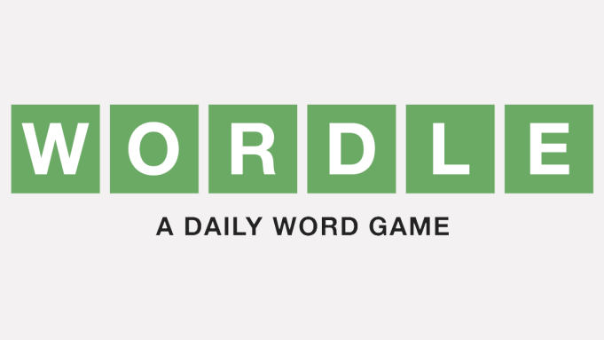
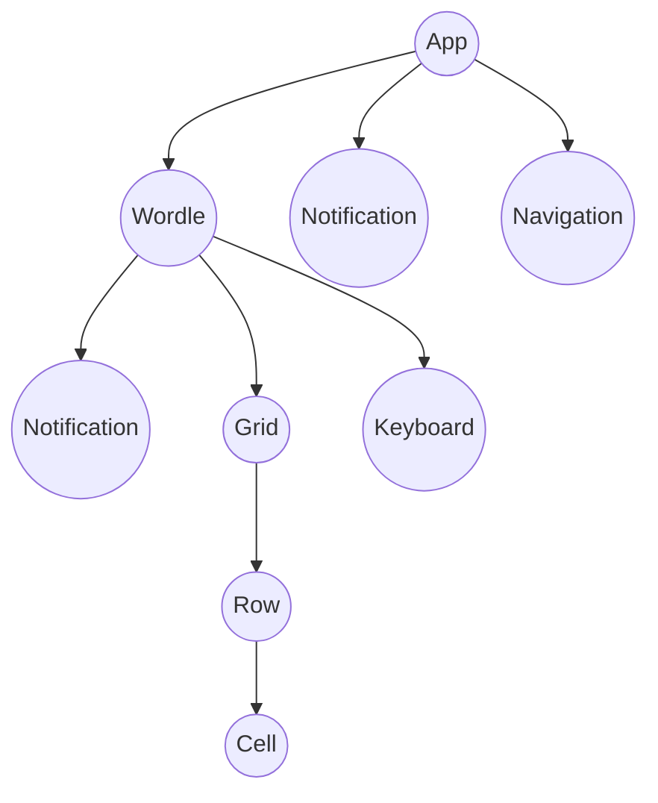

# Wordle

[](public/wordle.png)

A React clone of the game wordle (for learning purposes - don't sue me NYT)

## Dependecies

- React
- usehooks-ts
- Vite

## Project Structure

```

├── components
│   ├── Cell			<- Renders every letter and it's state.
│   ├── Grid			<- Renders every row and with it's cell children
│   ├── Keyboard 		<- Renders the qwerty keyboard
│   ├── Navigation 		<- Renders the wordle heading
│   ├── Notification
│   ├── Row 			<- Renders game states - loose, win, errors
│   └── Wordle 			<- Renders the Grid and Keyboard
├── data
│   └── db.json 		<- List of words for demo rest json service using json-server
├── types 			<- TypeScript types.
└── hooks
 ├── useGuesses.ts 		<- Logic for tracking guesses
 └── useKeyPress.ts 		<- Capture all key presses, returns key values
```

## Component Tree



## Deployment & Hosting

- Github Actions
- Github pages

## Project goals (Lessons)

- Hooks
- React + TypeScript
- CI/CD workflow with GitHub Actions
- Simple react file/directory structure
- Vite aliases
- Why/When react re-renders
