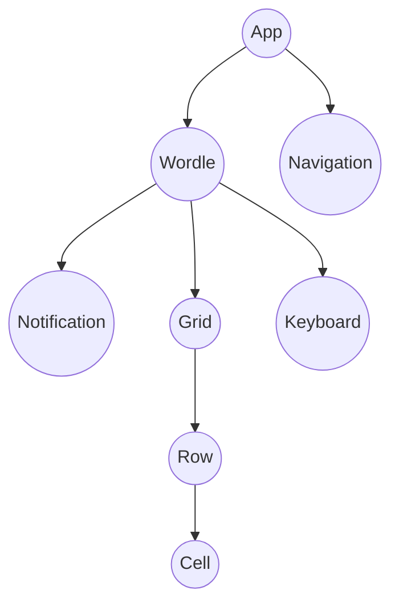

# Wordle

[](public/wordle.png)

A React clone of the game wordle (for learning purposes - don't sue me NYT)

[Demo](https://ingadi.github.io/wordle-clone/).

## Project Structure

```

├── components
│   ├── Navigation 		<- Renders the 'wordle' title
│   ├── Cell			<- Renders a single letter input.
│   ├── Row 			<- Renders every cell and shows game states (loose, win, errors) for a single row
│   ├── Grid			<- Renders every row
│   ├── Keyboard 		<- Renders the qwerty keyboard
│   ├── Notification <- Renders a tooltip to show game states (loose, win, errors) textually
│   └── Wordle 			<- Renders the Grid and Keyboard
├── types 			<- TypeScript types.
└── hooks
    ├── useGuesses.ts 		<- Logic for tracking guesses
    └── useKeyPress.ts 		<- Capture all key presses, returns key values
```

## Component Tree


